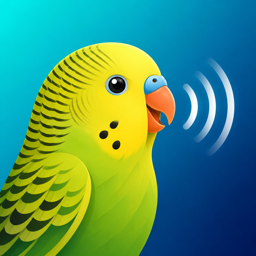

<p align="center">
  
</p>

# parakeet-rs

Native macOS / Apple Silicon dictation menu-bar app. Press a global
hotkey, speak, transcript inserts at your cursor. Fully local — no API
keys, no network after the first-run model download.

- **ASR**: NVIDIA Parakeet TDT 0.6B v3 int8 via sherpa-onnx + CoreML
- **Polish (optional)**: Qwen 3.5 2B Q4_K_M via llama.cpp + Metal
- **Shell**: AppKit single binary (no Tauri / Electron)
- **Text injection**: `CGEventKeyboardSetUnicodeString` keystroke

## Install from source

No prebuilt releases — build it yourself. Apple Silicon Mac, macOS 11.0+.

1. **Install prerequisites** (skip what you already have):
   ```bash
   xcode-select --install                                            # codesign, cc, install_name_tool
   curl --proto '=https' --tlsv1.2 -sSf https://sh.rustup.rs | sh    # Rust 1.77+
   ```
2. **Clone, build, install**:
   ```bash
   git clone https://github.com/moorbrook/parakeet-rs && cd parakeet-rs
   scripts/make-app.sh                                               # ~60 s cold
   cp -R target/release/bundle/osx/Parakeet.app /Applications/
   open /Applications/Parakeet.app
   ```
3. **Gatekeeper bypass**: macOS may refuse the first launch with "Apple
   cannot verify this app is free of malware" because the bundle is
   ad-hoc signed (not from a Developer ID). Right-click the app in
   Finder → Open → Open Anyway. One-time confirmation.

For stable TCC permissions across rebuilds (so macOS doesn't treat each
build as a new app and re-prompt for Microphone / Accessibility / Input
Monitoring), generate a self-signed "Parakeet Local Dev" cert in
Keychain Access, then:

```bash
PARAKEET_SIGN_ID='Parakeet Local Dev' scripts/make-app.sh
```

## First launch

1. macOS prompts for **Microphone**, **Accessibility**, and **Input
   Monitoring** in System Settings → Privacy & Security. All three are
   required.
2. ~640 MB of model files download to
   `~/Library/Application Support/com.parakeet.rs/models/`. Menu bar
   status text shows progress.
3. Press `⌘⇧Space` (default hotkey), speak. **Tap mode** auto-stops at
   end-of-speech; **Hold mode** stops on release.

### Optional polish pass


Flip Polish to On in Settings. Fetch the Qwen GGUF (see
`bench/README.md` for the one-liner) into
`~/Library/Application Support/com.parakeet.rs/llm/qwen3.5-2b-q4_k_m/`.
Polish strips fillers, fixes punctuation, honours inline commands
("new paragraph", "scratch that"); adds ~550 ms wall-clock but streams
to the cursor on word boundaries.

## Caveats

- **Apple Silicon only.** No plans for a universal binary
  ([ADR-0002](docs/ADR.md#0002--macos-only)).
- **Text injection** works in terminals (Ghostty, iTerm2, Terminal.app),
  browsers, native Cocoa, Electron (Slack/VS Code/etc.), JetBrains,
  Xcode. Doesn't reach password fields or apps with aggressive input
  filtering.
- **Build size**: ~7 MB binary + ~50 MB bundled dylibs (mostly
  onnxruntime and llama-cpp).

## Layout

App state lives behind two small state machines so the
session/polish-load races stay localised:

- `src/app.rs` — orchestration, supervised worker spawns, panic recovery
- `src/dictation_fsm.rs` — atomic (state, session, pending_terminate)
- `src/llm_manager.rs` — polish-LLM lifecycle (Disabled / Loading / Ready)
- `src/polish.rs` — `PolishBackend` trait + `PromptTemplate` + decode loop
- `src/paste.rs` — `TextSink` trait + word-boundary `Streamer`
- `src/ax_paste.rs` — `CGEvent` keystroke implementation
- `src/streamer.rs` — per-session VAD/manual capture
- `src/{audio,asr,vad,hud,hotkey,menubar,settings,settings_ui,…}.rs`

Two headless benches under `src/bin/`: `bench_asr` and `bench_llm`.

Architectural rationale lives in [`docs/ADR.md`](docs/ADR.md) (decisions
0001-0019); latency targets and measurements in
[`docs/latency-plan.md`](docs/latency-plan.md).

## Verification

```bash
cargo build --release && scripts/make-app.sh
cargo test                                       # 77 unit tests
cargo clippy --all-targets --no-deps             # clean
```

## Roadmap

- Auto-download the polish GGUF on first toggle-on (currently manual).
- Wire keyboard shortcut customization into the Settings UI.

## License

Dual-licensed under [MIT](LICENSE-MIT) or [Apache-2.0](LICENSE-APACHE)
at your option (Rust ecosystem convention).

Runtime-downloaded models ship under their own licenses: Parakeet TDT
0.6B v3 (NVIDIA), Silero VAD (MIT), Qwen 3.5 2B Instruct (Apache-2.0).
