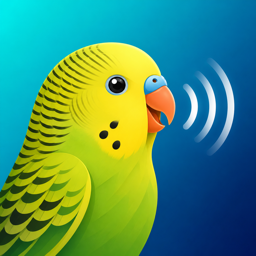

<p align="center">
  
</p>

# parakeet-rs

Native macOS / Apple Silicon dictation menu-bar app. Press a global
hotkey, speak, transcript inserts at your cursor. Fully local — no API
keys, no network after the first-run model download.

- **ASR**: NVIDIA Parakeet TDT 0.6B v3 int8 via sherpa-onnx + CoreML
- **Polish (optional)**: Qwen 3.5 4B Q6_K via llama.cpp + Metal
- **Shell**: AppKit single binary (no Tauri / Electron)
- **Text injection**: `CGEventKeyboardSetUnicodeString` keystroke

## Install from source

No prebuilt releases — build it yourself. Apple Silicon Mac, macOS 11.0+.

1. **Install prerequisites** (skip what you already have):
   ```bash
   xcode-select --install                                            # codesign, cc, install_name_tool
   curl --proto '=https' --tlsv1.2 -sSf https://sh.rustup.rs | sh    # Rust 1.77+
   ```
2. **Clone, build, install**:
   ```bash
   git clone https://github.com/moorbrook/parakeet-rs && cd parakeet-rs
   scripts/make-app.sh                                               # ~60 s cold
   cp -R target/release/bundle/osx/Parakeet.app /Applications/
   open /Applications/Parakeet.app
   ```
3. **Gatekeeper bypass**: macOS may refuse the first launch with "Apple
   cannot verify this app is free of malware" because the bundle is
   ad-hoc signed (not from a Developer ID). Right-click the app in
   Finder → Open → Open Anyway. One-time confirmation.

For stable TCC permissions across rebuilds (so macOS doesn't treat each
build as a new app and re-prompt for Microphone / Accessibility / Input
Monitoring), generate a self-signed "Parakeet Local Dev" cert in
Keychain Access, then:

```bash
PARAKEET_SIGN_ID='Parakeet Local Dev' scripts/make-app.sh
```

## First launch

1. macOS prompts for **Microphone**, **Accessibility**, and **Input
   Monitoring** in System Settings → Privacy & Security. All three are
   required.
2. ~640 MB of model files download to
   `~/Library/Application Support/com.parakeet.rs/models/`. Menu bar
   status text shows progress.
3. Press `⌘⇧Space` (default hotkey), speak. **Tap mode** auto-stops at
   end-of-speech; **Hold mode** stops on release.

While listening, a large-display HUD shows an animated pastel-iridescent
waveform on a 70%-alpha glass panel. macOS 26 and later use
`NSGlassEffectView`; older supported releases fall back to
`NSVisualEffectView`.

For HUD-only development, launch a debug build with the preview hook:

```bash
PARAKEET_HUD_PREVIEW=1 cargo run
```

The app opens directly into the Listening HUD without starting a dictation
session.

### Optional polish pass


Flip Polish to On in Settings; the Qwen GGUF (3.5 GB) downloads
automatically on first enable. Polish strips fillers, fixes
punctuation, honours inline commands ("new paragraph", "scratch
that"); adds wall-clock latency but streams to the cursor on word
boundaries.

### Custom vocabulary

Settings → **Edit Vocabulary…** opens a plain text file in your editor.
One term or phrase per line, spelled the way you want it transcribed:

```
Kubernetes
Ghostty
New York
```

Those words get boosted during recognition, which is the fix for names,
jargon, and product names Parakeet mishears. Click Save in Settings
afterwards — the recogniser rebuilds in the background (or as soon as
the current dictation finishes).

Terms are validated against the model's token inventory, so a word the
model can't represent (emoji, unusual scripts) is reported in the log
and skipped rather than silently doing nothing.

An empty list costs nothing. A non-empty one switches the decoder from
greedy to beam search, measured at **+13%** decode time
([ADR-0020](docs/ADR.md#0020--vocabulary-sherpa-contextual-biasing-generated-from-a-plain-text-list)).
The boost strength is `hotword_score` in `settings.json`, default 2.0;
values above ~6 start injecting your terms into audio that doesn't
contain them, so re-check with `asr_diff` if you raise it.

## Caveats

- **Apple Silicon only.** No plans for a universal binary
  ([ADR-0002](docs/ADR.md#0002--macos-only)).
- **Text injection** works in terminals (Ghostty, iTerm2, Terminal.app),
  browsers, native Cocoa, Electron (Slack/VS Code/etc.), JetBrains,
  Xcode. Doesn't reach password fields or apps with aggressive input
  filtering. When injection fails *observably*, the transcript goes to
  the clipboard and the menu bar says so. `CGEventPost` gives no
  delivery receipt, so an app that accepts the keystroke and discards it
  still looks like success — see [`PRIVACY.md`](PRIVACY.md#clipboard).
- **Build size**: ~7 MB binary + ~50 MB bundled dylibs (mostly
  onnxruntime and llama-cpp).

## Layout

App state lives behind two small state machines so the
session/polish-load races stay localised:

- `src/app.rs` — orchestration, supervised worker spawns, panic recovery
- `src/dictation_fsm.rs` — atomic (state, session, pending_terminate)
- `src/llm_manager.rs` — polish-LLM lifecycle (Disabled / Loading / Ready)
- `src/polish.rs` — `PolishBackend` trait + `PromptTemplate` + decode loop
- `src/paste.rs` — `TextSink` trait + word-boundary `Streamer`
- `src/ax_paste.rs` — `CGEvent` keystroke implementation
- `src/streamer.rs` — per-session VAD/manual capture
- `src/vocabulary.rs` — `vocabulary.txt` → sherpa hotwords encoding
- `src/clipboard.rs` — rescue copy when keystroke delivery fails
- `src/{audio,asr,vad,hud,hotkey,menubar,settings,settings_ui,…}.rs`

Three headless harnesses under `src/bin/`: `bench_asr` and `bench_llm`
(latency), and `asr_diff` (transcript regressions — see below).

Privacy behaviour — what each permission does, what touches the network,
what lands on disk — is documented in [`PRIVACY.md`](PRIVACY.md).

Architectural rationale lives in [`docs/ADR.md`](docs/ADR.md) (decisions
0001-0021); latency targets and measurements in
[`docs/latency-plan.md`](docs/latency-plan.md). The deferred
Developer-ID/notarization shipping procedure is captured in
[`docs/notarized-distribution.md`](docs/notarized-distribution.md).

## Verification

```bash
cargo build --release && scripts/make-app.sh
cargo test                                       # 118 unit tests
cargo clippy --all-targets --no-deps             # clean
```

Anything that could change what the recogniser *says* — model weights,
execution provider, vocabulary, hotword score — should also be checked
against recorded transcripts, not just latency:

```bash
scripts/bench-latency.sh                 # generates bench/audio/ fixtures
./target/release/asr_diff --record       # baseline (machine-local)
# ...make the change...
./target/release/asr_diff                # exits 1 on any transcript drift
```

## Roadmap

- Wire keyboard shortcut customization into the Settings UI.

## License

Dual-licensed under [MIT](LICENSE-MIT) or [Apache-2.0](LICENSE-APACHE)
at your option (Rust ecosystem convention).

Runtime-downloaded models ship under their own licenses: Parakeet TDT
0.6B v3 (NVIDIA), Silero VAD (MIT), Qwen 3.5 4B Instruct (Apache-2.0).
